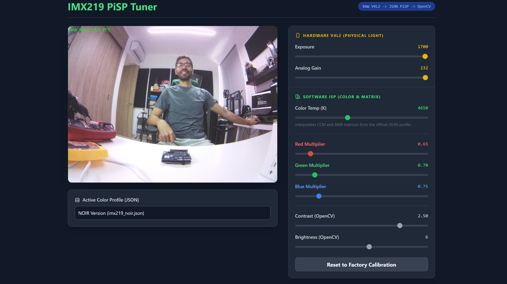

# IMX219 Advanced ISP & RAW Capture for Arduino UNO Q

A custom V4L2 RAW capture pipeline and Python Software ISP for the IMX219 MIPI camera. This repository bypasses standard hardware memory limits to capture full 8MP 10-bit frames, applying JSON color profiles (PiSP) for precise colorimetry, Auto White Balance (AWB), and hardware exposure control.



## 🛠️ Hardware Requirements
To run this project, you will need the following hardware:
* **Arduino UNO Q**
* **Arduino UNO Media Carrier**
* **IMX219 MIPI Camera Module** (Standard or NOIR)

**Note:** Your Arduino UNO Q must be flashed with one of the latest image versions (> 523).

## 🎨 Color Correction & ISP Bypass

By using lower-level settings and bypassing the default hardware ISP, you can get much better photos.

## 📷 Enable the Media Carrier

Some overlays are needed to enable the Arduino Media Carrier:

```bash
cd /boot/efi/dtb/qcom/ # navigate to this directory

sudo fdtoverlay -i qrb2210-arduino-imola-base.dtb -o qrb2210-arduino-imola.dtb qrb2210-arduino-imola-carrier-media.dtbo qrb2210-arduino-imola-carrier-media-camera-imx219-csi1-2lanes.dtbo qrb2210-arduino-imola-video_sound-usbc.dtbo
```

**Note:** Use the `.dtbo` for the right connector where your MIPI camera is attached.

- **CAMERA0:** `qrb2210-arduino-imola-carrier-media-camera-imx219-csi0-2lanes.dtbo`
- **CAMERA1:** `qrb2210-arduino-imola-carrier-media-camera-imx219-csi1-2lanes.dtbo`

## ⚙️ Installation

**1. Clone the repository:**

```bash
git clone https://github.com/mcmchris/uno-q-mipi-camera-imx219.git
cd uno-q-mipi-camera-imx219
```

**2. Install dependencies:**

Make sure you have the required Python libraries installed by running:

```bash
sudo apt update && sudo apt install python3-flask python3-numpy python3-opencv -y
```

(Note: You will also need `v4l2-ctl` and `media-ctl` installed on your Linux system, which are usually included in the v4l-utils package).

**3. Make the router scripts executable:**

Grant execution permissions to the bash scripts inside the `router/` folder so Python can trigger the hardware MIPI routing automatically:

```bash
chmod +x router/*.sh
```

## 🚀 Usage & Scripts

This repository includes two main workflows:

**1. Real-Time Streaming & Tuning Dashboard (streaming.py)**

This script launches a Flask web server that streams video from the camera while providing an advanced "PiSP Tuner" web dashboard. You can use it to calibrate the exact color temperature, RGB multipliers, exposure, and analog gain in real time.

**Execution:**

```bash
sudo python3 streaming.py
```

**Expected Result:**

The terminal will output the IP address of your board. Open a web browser on any device on the same local network and navigate to `http://<BOARD_IP>:8080`. You will see the live feed and the control panel. Any changes made on the sliders will instantly reflect on the camera's hardware registers and software color matrices.

**2. Color Corrected Still Photo (perfect_photo.py)**

Once you have found your ideal lighting and color settings in the dashboard, you can plug those numbers into the `SETTINGS` dictionary inside this script. This script bypasses OpenCV's video capture limits to grab a single, maximum-quality 8 Megapixel (3280x2464) frame directly from the kernel memory.

**Execution:**

```bash
sudo python3 perfect_photo.py
```

**Expected Result:**

The script will route the V4L2 hardware to maximum resolution, apply your custom exposure/gain, purge unstable initial frames to prevent Bayer phase shifting (magenta tints), capture the RAW data, and process the color science. Finally, it will save a pristine, full-resolution image named `color_corrected.jpg` in your project directory.